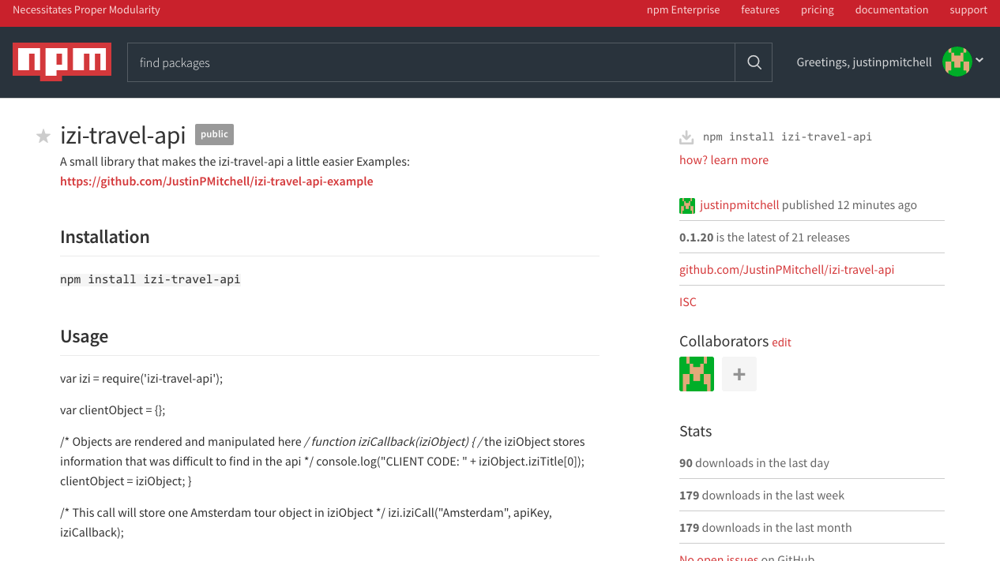

# IZI Travel API Node Module

A small library that makes the izi-travel-api a little easier
NPM - https://www.npmjs.com/package/izi-travel-api

## Approach Taken

* Researched API
* Formulated a call
* Exported and Published the initial version
* Created an Exemplar
* Continued to update

## Built With

* [IZI-TRAVEL-API](https://api-docs.izi.travel/#overview) - Large API storing tourist information
* [Node](https://nodejs.org) - express, ejs, express-ejs-layouts, body-parser, izi-travel-api(https://www.npmjs.com/package/izi-travel-api)
* [Bootstrap](https://getbootstrap.com/) - Navbar, Grid

## Unsolved Problems

* The izi-travel-api can call multiple locations, but this restricts the amount of data that can be gathered.
* More precise calls can be made.
* Images are not being deleted completely

## Interesting Notes

* The module can store up to 10 api calls of information
* Published on NPM(https://www.npmjs.com/package/izi-travel-api)
* Can take in lattitude and longitude of a tour or museum and plot them
* Image files are being prepared by concatinating multiple uuid's, audio files can be found in a similar way
* There is quite a bit of data being stored on this api
* Code is extensible
* Can take in City Names with spaces

## Next Steps

* Refine the initial call
* Add different api functions that are faster and more precise
* Store entire api call in an object

## Authors

* **Justin Mitchell** - *Initial work* - [JustinPMitchell](https://github.com/JustinPMitchell)

## Acknowledgments

* Special Thanks to Jordan Krissi and Nick Nedev(https://github.com/nnedevn)
* Thanks to Joanne(https://codeburst.io/how-to-create-and-publish-your-first-node-js-module-444e7585b738)